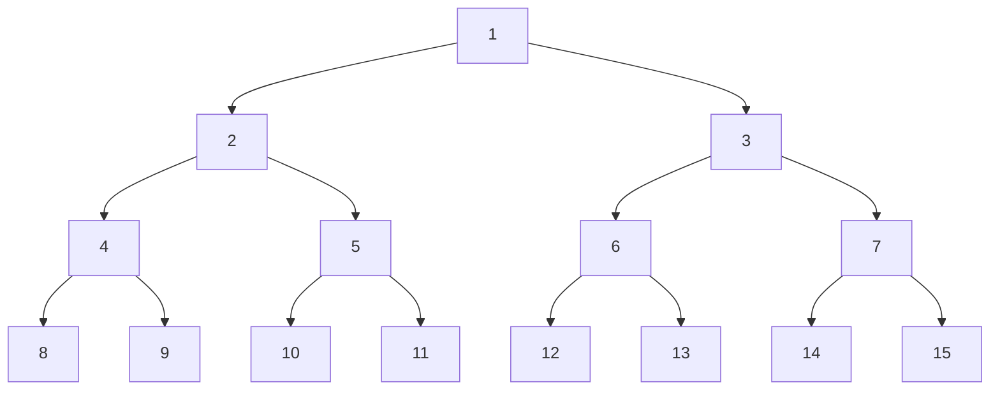
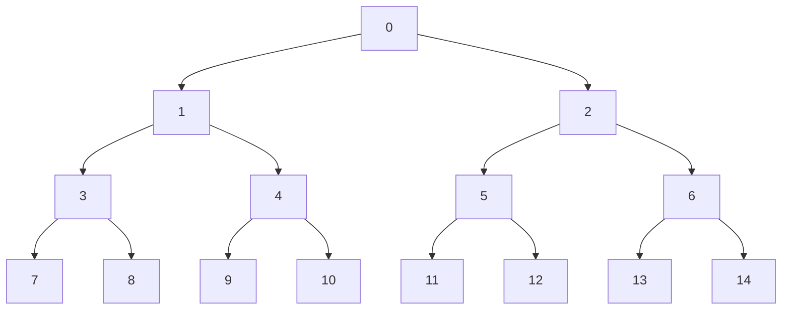
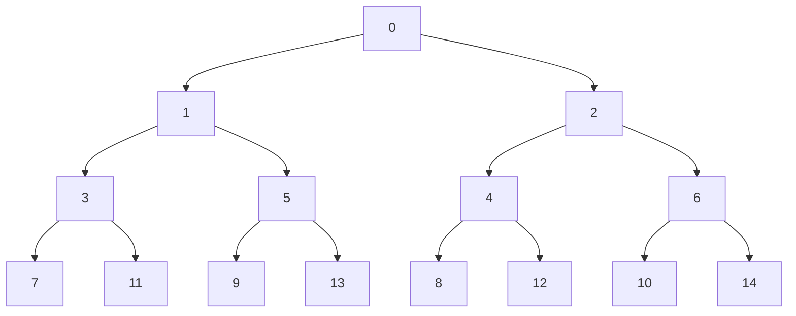

+++
date = '2025-02-25T12:00:00+00:00'
draft = false
title = 'Binary Indexing of Binary Trees'
summary = "The natural way of counting nodes"
toc = true
readTime = true
autonumber = true
math = true
tags = ["datastructures", "binary", "trees"]
showTags = false
hideBackToTop = false
+++

## Background

*Disclaimer*: I assume anyone who is reading this knows about binary trees. The indexing method described in this post may already be known or used in practice; however, I did not find it mentioned online. Hence, I'll just elaborate on how I derived it for myself.

Before we start, here is a refresher on what a numbered tree might look like.

### Design Goals

When "comparing" different indexing methods, one should consider what the goal is. In this case, I was motivated to find indexing that is **idempotent** to adding new nodes. A node in the tree (e.g., the left child of the root node) should have the same number whether the tree has 1 or $\infty$ layers.

### Breadth-First Method

The indexing method which most people might be familiar with is **breadth-first order**. The resulting tree would look something like this:

Initially, that seems reasonable. Every layer gets enumerated until moving to the next layer. In mathematical terms, if a node has index $i$, its children are at $2i+1$ (left) and $2i+2$ (right). However, let's think about **tree traversal**. How often do you process a tree layer by layer? Surely, most of the time, trees are traversed along the height of the tree, always choosing children of the current node.

### Binary Indexing Method

How about we instead alternate numbering between trees? For example:

If we look at the numbers in binary it looks like this:

| Decimal | Binary |
| ------- | ------ |
| 0       | 0000   |
| 1       | 0001   |
| 2       | 0010   |
| 3       | 0011   |
| 4       | 0100   |
| 5       | 0101   |
| 6       | 0110   |
| 7       | 0111   |
| 8       | 1000   |
| 9       | 1001   |
| 10      | 1010   |
| 11      | 1011   |
| 12      | 1100   |
| 13      | 1101   |
| 14      | 1110   |

Zooming in on the index-$1$ subtree:

| Decimal | Binary   |
| ------- | -------- |
| 1       | 000**1** |
| 3       | 001**1** |
| 7       | 01**11** |
| 11      | 10**11** |
| 5       | 010**1** |
| 9       | 10**01** |
| 13      | 11**01** |

I've highlighted the ending bits in this graphic. As you can see, nodes always share the same ending bits with their parents.

## Practical Implications

I have yet to do practical benchmarking on the effectiveness of this method; however, it might have a nice benefit for prefetching and caching. If all nodes of a subtree $b'$ end in the same offset bits one could effectively cache _exclusively_ the nodes of this subtree by using **stride prefetching** with the stride appropriate to the tree depth. Depending on the memory layout and nature of the application this could be faster than random node access and might be interesting for low-latency applications where an extra memory lookup with a cache miss adds noticeable latency overhead.
